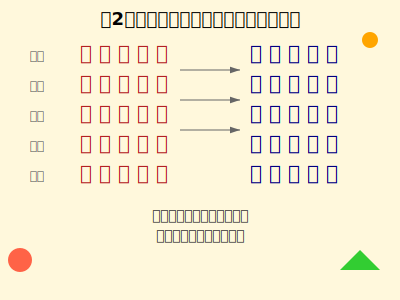

# 第2章：片假字与平假名读音与意思对比

清晨的薄雾还未散去，古都的庭院里传来阵阵鸟鸣。在这宁静的时光里，我们翻开那本泛黄的书卷，凝视着那些静静躺在纸上的假名。每一个字符都如同清晨的露珠，晶莹剔透，承载着语言的韵律。片假名与平假名，它们在日语的世界里各自绽放着独特的光芒，如同古都里那些古老的建筑，虽风格迥异，却共同构成了这门语言的完整画卷。

本章将详细介绍每个片假字的中文和日语读音，并解释其意思和使用场景。

## ア行（あ行）

春天的京都，樱花飘洒在古老的石板路上。一位身着和服的女子缓缓走过，她的名字里有一个"あ"字，发音轻柔如春风。ア、イ、ウ、エ、オ，这五个假名如同初春的嫩芽，在日语的世界里悄然萌发。它们不仅是语言的起点，更像是古都春天的象征，承载着无数美好的故事。

### ア (a)
- **日语读音**：ア (a)
- **中文读音**：ā
- **对应平假名**：あ (a)
- **平假名特点**：平假名あ的形状更加圆润，笔画较多，书写相对复杂。主要用于日语固有词汇和语法助词，如：あい (ai, 爱)、あかるい (akarui, 明亮的)等。
- **意思**：表示"啊"的感叹词，也用于一些外来语
- **使用场景**：
  - 感叹词：ア！（啊！）
  - 外来语：アジア (ājia, 亚洲)

### イ (i)
- **日语读音**：イ (i)
- **中文读音**：ī
- **对应平假名**：い (i)
- **平假名特点**：平假名い的形状更加圆润，笔画较多，书写相对复杂。主要用于日语固有词汇和语法助词，如：いい (ii, 好的)、いかが (ikaga, 如何)等。
- **意思**：表示"衣"的音，也用于一些外来语
- **使用场景**：
  - 外来语：イタリア (itaria, 意大利)

### ウ (u)
- **日语读音**：ウ (u)
- **中文读音**：ū
- **对应平假名**：う (u)
- **平假名特点**：平假名う的形状更加圆润，笔画较多，书写相对复杂。主要用于日语固有词汇和语法助词，如：うみ (umi, 海)、うれしい (ureshii, 高兴的)等。
- **意思**：表示"乌"的音，也用于一些外来语
- **使用场景**：
  - 外来语：アメリカ (amerika, 美国)

### エ (e)
- **日语读音**：エ (e)
- **中文读音**：ē
- **对应平假名**：え (e)
- **平假名特点**：平假名え的形状更加圆润，笔画较多，书写相对复杂。主要用于日语固有词汇和语法助词，如：えいが (eiga, 电影)、おいしい (oishii, 美味的)等。
- **意思**：表示"诶"的音，也用于一些外来语
- **使用场景**：
  - 外来语：エネルギー (enerugī, 能源)

### オ (o)
- **日语读音**：オ (o)
- **中文读音**：ō
- **对应平假名**：お (o)
- **平假名特点**：平假名お的形状更加圆润，笔画较多，书写相对复杂。主要用于日语固有词汇和语法助词，如：おはよう (ohayou, 早上好)、おやすみ (oyasumi, 晚安)等。
- **意思**：表示"哦"的音，也用于一些外来语
- **使用场景**：
  - 外来语：オーストラリア (ōsutoraria, 澳大利亚)

## カ行（か行）

秋日的黄昏，古都的枫叶正红。一位老者坐在庭院里，手中拿着一份报纸，上面的"カ"字在夕阳下显得格外清晰。カ、キ、ク、ケ、コ，这五个假名如同秋日的果实，在日语的枝头成熟着。它们承载着岁月的沉淀，每一个字符都蕴含着丰富的情感和深意。

### カ (ka)
- **日语读音**：カ (ka)
- **中文读音**：kā
- **对应平假名**：か (ka)
- **平假名特点**：平假名か的形状更加圆润，笔画较多，书写相对复杂。主要用于日语固有词汇和语法助词，如：かさ (kasa, 伞)、かえる (kaeru, 回来)等。
- **意思**：表示"卡"的音，也用于一些外来语
- **使用场景**：
  - 外来语：カメラ (kamera, 照相机)

### キ (ki)
- **日语读音**：キ (ki)
- **中文读音**：kī
- **对应平假名**：き (ki)
- **平假名特点**：平假名き的形状更加圆润，笔画较多，书写相对复杂。主要用于日语固有词汇和语法助词，如：きのう (kinou, 昨天)、きいろ (kiiro, 黄色)等。
- **意思**：表示"基"的音，也用于一些外来语
- **使用场景**：
  - 外来语：キリスト教 (kurisuto-kyō, 基督教)

### ク (ku)
- **日语读音**：ク (ku)
- **中文读音**：kū
- **对应平假名**：く (ku)
- **平假名特点**：平假名く的形状更加圆润，笔画较多，书写相对复杂。主要用于日语固有词汇和语法助词，如：くま (kuma, 熊)、ください (kudasai, 请)等。
- **意思**：表示"库"的音，也用于一些外来语
- **使用场景**：
  - 外来语：クラブ (kurabu, 俱乐部)

### ケ (ke)
- **日语读音**：ケ (ke)
- **中文读音**：kē
- **对应平假名**：け (ke)
- **平假名特点**：平假名け的形状更加圆润，笔画较多，书写相对复杂。主要用于日语固有词汇和语法助词，如：けさ (kesa, 今天早上)、けしごむ (keshigomu, 橡皮擦)等。
- **意思**：表示"克"的音，也用于一些外来语
- **使用场景**：
  - 外来语：ケーキ (kēki, 蛋糕)

### コ (ko)
- **日语读音**：コ (ko)
- **中文读音**：kō
- **对应平假名**：こ (ko)
- **平假名特点**：平假名こ的形状更加圆润，笔画较多，书写相对复杂。主要用于日语固有词汇和语法助词，如：こえ (koe, 声音)、こども (kodomo, 孩子)等。
- **意思**：表示"科"的音，也用于一些外来语
- **使用场景**：
  - 外来语：コーヒー (kōhī, 咖啡)

## サ行（さ行）

夏日的午后，蝉鸣声此起彼伏。在一家古老的茶屋里，一位茶师正在准备茶具，他的动作轻柔而优雅，如同"サ"字的曲线。サ、シ、ス、セ、ソ，这五个假名如同夏日的清风，在日语的天空中轻柔地飘荡。它们承载着季节的温度，每一个字符都散发着淡淡的清香。

### サ (sa)
- **日语读音**：サ (sa)
- **中文读音**：sā
- **对应平假名**：さ (sa)
- **平假名特点**：平假名さ的形状更加圆润，笔画较多，书写相对复杂。主要用于日语固有词汇和语法助词，如：さくら (sakura, 樱花)、さん (san, 先生/小姐)等。
- **意思**：表示"萨"的音，也用于一些外来语
- **使用场景**：
  - 外来语：サラダ (sarada, 沙拉)

### シ (shi)
- **日语读音**：シ (shi)
- **中文读音**：shī
- **对应平假名**：し (shi)
- **平假名特点**：平假名し的形状更加圆润，笔画较多，书写相对复杂。主要用于日语固有词汇和语法助词，如：しろ (shiro, 白色)、します (shimasu, 做)等。
- **意思**：表示"希"的音，也用于一些外来语
- **使用场景**：
  - 外来语：シーツ (shītsu, 床单)

### ス (su)
- **日语读音**：ス (su)
- **中文读音**：sū
- **对应平假名**：す (su)
- **平假名特点**：平假名す的形状更加圆润，笔画较多，书写相对复杂。主要用于日语固有词汇和语法助词，如：すし (sushi, 寿司)、すみません (sumimasen, 对不起)等。
- **意思**：表示"苏"的音，也用于一些外来语
- **使用场景**：
  - 外来语：スーパー (sūpā, 超市)

### セ (se)
- **日语读音**：セ (se)
- **中文读音**：sē
- **对应平假名**：せ (se)
- **平假名特点**：平假名せ的形状更加圆润，笔画较多，书写相对复杂。主要用于日语固有词汇和语法助词，如：せん (sen, 线)、せいかい (seikai, 正确)等。
- **意思**：表示"塞"的音，也用于一些外来语
- **使用场景**：
  - 外来语：セックス (sekkusu, 性)

### ソ (so)
- **日语读音**：ソ (so)
- **中文读音**：sō
- **对应平假名**：そ (so)
- **平假名特点**：平假名そ的形状更加圆润，笔画较多，书写相对复杂。主要用于日语固有词汇和语法助词，如：そら (sora, 天空)、そうです (sou desu, 是的)等。
- **意思**：表示"索"的音，也用于一些外来语
- **使用场景**：
  - 外来语：ソフト (sofuto, 软件)

## タ行（た行）

冬日的清晨，雪花静静地飘洒在古都的屋顶上。一位年轻的母亲正在为孩子准备早餐，她的名字里有一个"た"字，发音温暖如炉火。タ、チ、ツ、テ、ト，这五个假名如同冬日的雪花，在日语的世界里轻柔地飘落。它们承载着季节的纯净，每一个字符都蕴含着家的温暖。

### タ (ta)
- **日语读音**：タ (ta)
- **中文读音**：tā
- **对应平假名**：た (ta)
- **平假名特点**：平假名た的形状更加圆润，笔画较多，书写相对复杂。主要用于日语固有词汇和语法助词，如：たべる (taberu, 吃)、たのしい (tanoshii, 有趣的)等。
- **意思**：表示"塔"的音，也用于一些外来语
- **使用场景**：
  - 外来语：タクシー (takushī, 出租车)

### チ (chi)
- **日语读音**：チ (chi)
- **中文读音**：chī
- **对应平假名**：ち (chi)
- **平假名特点**：平假名ち的形状更加圆润，笔画较多，书写相对复杂。主要用于日语固有词汇和语法助词，如：ちいさい (chiisai, 小的)、ちかてつ (chikatetsu, 地铁)等。
- **意思**：表示"奇"的音，也用于一些外来语
- **使用场景**：
  - 外来语：チーズ (chīzu, 奶酪)

### ツ (tsu)
- **日语读音**：ツ (tsu)
- **中文读音**：tsū
- **对应平假名**：つ (tsu)
- **平假名特点**：平假名つ的形状更加圆润，笔画较多，书写相对复杂。主要用于日语固有词汇和语法助词，如：つき (tsuki, 月亮)、つける (tsukeru, 附上)等。
- **意思**：表示"次"的音，也用于一些外来语
- **使用场景**：
  - 外来语：ツナ (tsuna, 金枪鱼)

### テ (te)
- **日语读音**：テ (te)
- **中文读音**：tē
- **对应平假名**：て (te)
- **平假名特点**：平假名て的形状更加圆润，笔画较多，书写相对复杂。主要用于日语固有词汇和语法助词，如：てがみ (tegami, 信)、てつだう (tetsudau, 帮助)等。
- **意思**：表示"特"的音，也用于一些外来语
- **使用场景**：
  - 外来语：テスト (tesuto, 测试)

### ト (to)
- **日语读音**：ト (to)
- **中文读音**：tō
- **对应平假名**：と (to)
- **平假名特点**：平假名と的形状更加圆润，笔画较多，书写相对复杂。主要用于日语固有词汇和语法助词，如：とけい (tokei, 钟表)、とる (toru, 拿)等。
- **意思**：表示"托"的音，也用于一些外来语
- **使用场景**：
  - 外来语：トマト (tomato, 番茄)

## ナ行（な行）

夜晚的古都，星光点点洒在寂静的街巷里。一位诗人坐在窗前，凝视着远方的灯火，他的诗稿上有一个"な"字，如同夜空中的繁星。ナ、ニ、ヌ、ネ、ノ，这五个假名如同夜空中的星辰，在日语的夜空中静静闪烁。它们承载着夜晚的宁静，每一个字符都蕴含着诗意的想象。

### ナ (na)
- **日语读音**：ナ (na)
- **中文读音**：nā
- **对应平假名**：な (na)
- **平假名特点**：平假名な的形状更加圆润，笔画较多，书写相对复杂。主要用于日语固有词汇和语法助词，如：なまえ (namae, 名字)、なくなる (naku naru, 消失)等。
- **意思**：表示"那"的音，也用于一些外来语
- **使用场景**：
  - 外来语：ナス (nasu, 茄子)

### ニ (ni)
- **日语读音**：ニ (ni)
- **中文读音**：nī
- **对应平假名**：に (ni)
- **平假名特点**：平假名に的形状更加圆润，笔画较多，书写相对复杂。主要用于日语固有词汇和语法助词，如：にほん (nihon, 日本)、にげる (nigeru, 逃跑)等。
- **意思**：表示"尼"的音，也用于一些外来语
- **使用场景**：
  - 外来语：ニット (nittu, 毛线)

### ヌ (nu)
- **日语读音**：ヌ (nu)
- **中文读音**：nū
- **对应平假名**：ぬ (nu)
- **平假名特点**：平假名ぬ的形状更加圆润，笔画较多，书写相对复杂。主要用于日语固有词汇和语法助词，如：ぬの (nuno, 布)、ぬぐ (nugu, 擦)等。
- **意思**：表示"努"的音，也用于一些外来语
- **使用场景**：
  - 外来语：ネクタイ (nekutai, 领带)

### ネ (ne)
- **日语读音**：ネ (ne)
- **中文读音**：nē
- **对应平假名**：ね (ne)
- **平假名特点**：平假名ね的形状更加圆润，笔画较多，书写相对复杂。主要用于日语固有词汇和语法助词，如：ねこ (neko, 猫)、ねがい (negai, 愿望)等。
- **意思**：表示"内"的音，也用于一些外来语
- **使用场景**：
  - 外来语：ネオン (neon, 霓虹灯)

### ノ (no)
- **日语读音**：ノ (no)
- **中文读音**：nō
- **对应平假名**：の (no)
- **平假名特点**：平假名の的形状更加圆润，笔画较多，书写相对复杂。主要用于日语固有词汇和语法助词，如：のむ (nomu, 喝)、のこる (nokoru, 剩余)等。
- **意思**：表示"诺"的音，也用于一些外来语
- **使用场景**：
  - 外来语：ノート (nōto, 笔记本)

## ハ行（は行）

晨曦初露，古都的庭院里弥漫着淡淡的薄雾。一位花匠正在修剪着樱花树，他的名字里有一个"は"字，如同这晨雾般轻柔。ハ、ヒ、フ、ヘ、ホ，这五个假名如同晨曦中的薄雾，在日语的世界里朦胧地飘荡。它们承载着清晨的宁静，每一个字符都蕴含着自然的诗意。

### ハ (ha)
- **日语读音**：ハ (ha)
- **中文读音**：hā
- **对应平假名**：は (ha)
- **平假名特点**：平假名は的形状更加圆润，笔画较多，书写相对复杂。主要用于日语固有词汇和语法助词，如：はな (hana, 花)、はしる (hashiru, 跑)等。
- **意思**：表示"哈"的音，也用于一些外来语
- **使用场景**：
  - 外来语：ハム (hamu, 火腿)

### ヒ (hi)
- **日语读音**：ヒ (hi)
- **中文读音**：hī
- **对应平假名**：ひ (hi)
- **平假名特点**：平假名ひ的形状更加圆润，笔画较多，书写相对复杂。主要用于日语固有词汇和语法助词，如：ひかり (hikari, 光)、ひる (hiru, 中午)等。
- **意思**：表示"希"的音，也用于一些外来语
- **使用场景**：
  - 外来语：ヒント (hinto, 提示)

### フ (fu)
- **日语读音**：フ (fu)
- **中文读音**：fū
- **对应平假名**：ふ (fu)
- **平假名特点**：平假名ふ的形状更加圆润，笔画较多，书写相对复杂。主要用于日语固有词汇和语法助词，如：ふゆ (fuyu, 冬天)、ふく (fuku, 服装)等。
- **意思**：表示"夫"的音，也用于一些外来语
- **使用场景**：
  - 外来语：フォーク (fōku, 叉子)

### ヘ (he)
- **日语读音**：ヘ (he)
- **中文读音**：hē
- **对应平假名**：へ (he)
- **平假名特点**：平假名へ的形状更加圆润，笔画较多，书写相对复杂。主要用于日语固有词汇和语法助词，如：へや (heya, 房间)、へだたる (hedataru, 相隔)等。
- **意思**：表示"黑"的音，也用于一些外来语
- **使用场景**：
  - 外来语：ヘリコプター (herikoputā, 直升机)

### ホ (ho)
- **日语读音**：ホ (ho)
- **中文读音**：hō
- **对应平假名**：ほ (ho)
- **平假名特点**：平假名ほ的形状更加圆润，笔画较多，书写相对复杂。主要用于日语固有词汇和语法助词，如：ほし (hoshi, 星星)、ほしい (hoshii, 想要)等。
- **意思**：表示"霍"的音，也用于一些外来语
- **使用场景**：
  - 外来语：ホテル (hoteru, 酒店)

## マ行（ま行）

山间的清泉潺潺流淌，映照着蓝天白云。一位少女正在溪边浣洗衣物，她的名字里有一个"ま"字，如同这清泉般纯净。マ、ミ、ム、メ、モ，这五个假名如同山间的清泉，在日语的世界里清澈地流淌。它们承载着自然的纯净，每一个字符都蕴含着生命的活力。

### マ (ma)
- **日语读音**：マ (ma)
- **中文读音**：mā
- **对应平假名**：ま (ma)
- **平假名特点**：平假名ま的形状更加圆润，笔画较多，书写相对复杂。主要用于日语固有词汇和语法助词，如：まど (mado, 窗户)、まつ (matsu, 松树)等。
- **意思**：表示"马"的音，也用于一些外来语
- **使用场景**：
  - 外来语：マスコミ (masukomi, 大众传媒)

### ミ (mi)
- **日语读音**：ミ (mi)
- **中文读音**：mī
- **对应平假名**：み (mi)
- **平假名特点**：平假名み的形状更加圆润，笔画较多，书写相对复杂。主要用于日语固有词汇和语法助词，如：みず (mizu, 水)、みる (miru, 看)等。
- **意思**：表示"米"的音，也用于一些外来语
- **使用场景**：
  - 外来语：ミス (misu, 小姐)

### ム (mu)
- **日语读音**：ム (mu)
- **中文读音**：mū
- **对应平假名**：む (mu)
- **平假名特点**：平假名む的形状更加圆润，笔画较多，书写相对复杂。主要用于日语固有词汇和语法助词，如：むし (mushi, 虫子)、むける (mukeru, 削皮)等。
- **意思**：表示"姆"的音，也用于一些外来语
- **使用场景**：
  - 外来语：ムード (mūdo, 氛围)

### メ (me)
- **日语读音**：メ (me)
- **中文读音**：mē
- **对应平假名**：め (me)
- **平假名特点**：平假名め的形状更加圆润，笔画较多，书写相对复杂。主要用于日语固有词汇和语法助词，如：めがね (megane, 眼镜)、めずらしい (mezurashii, 罕见的)等。
- **意思**：表示"梅"的音，也用于一些外来语
- **使用场景**：
  - 外来语：メール (mēru, 邮件)

### モ (mo)
- **日语读音**：モ (mo)
- **中文读音**：mō
- **对应平假名**：も (mo)
- **平假名特点**：平假名も的形状更加圆润，笔画较多，书写相对复杂。主要用于日语固有词汇和语法助词，如：もつ (motsu, 内脏)、もっと (motto, 更加)等。
- **意思**：表示"莫"的音，也用于一些外来语
- **使用场景**：
  - 外来语：モデル (mōderu, 模特)

## ヤ行（や行）

夜空中的月亮静静地悬挂在古都的上空，洒下一片银辉。一位年轻的母亲正在为孩子讲述着古老的故事，故事中有一个"や"字，如同这月光般温柔。ヤ、ユ、ヨ，这三个假名如同夜空中的月亮，在日语的世界里宁静地照耀。它们承载着夜晚的温柔，每一个字符都蕴含着母爱的深意。

### ヤ (ya)
- **日语读音**：ヤ (ya)
- **中文读音**：yā
- **对应平假名**：や (ya)
- **平假名特点**：平假名や的形状更加圆润，笔画较多，书写相对复杂。主要用于日语固有词汇和语法助词，如：やま (yama, 山)、やさしい (yasashii, 温柔的)等。
- **意思**：表示"亚"的音，也用于一些外来语
- **使用场景**：
  - 外来语：ヤング (yanggu, 年轻人)

### ユ (yu)
- **日语读音**：ユ (yu)
- **中文读音**：yū
- **对应平假名**：ゆ (yu)
- **平假名特点**：平假名ゆ的形状更加圆润，笔画较多，书写相对复杂。主要用于日语固有词汇和语法助词，如：ゆき (yuki, 雪)、ゆっくり (yukkuri, 慢慢地)等。
- **意思**：表示"由"的音，也用于一些外来语
- **使用场景**：
  - 外来语：ユニット (yunitto, 单元)

### ヨ (yo)
- **日语读音**：ヨ (yo)
- **中文读音**：yō
- **对应平假名**：よ (yo)
- **平假名特点**：平假名よ的形状更加圆润，笔画较多，书写相对复杂。主要用于日语固有词汇和语法助词，如：よる (yoru, 夜晚)、よろしい (yoroshii, 好的)等。
- **意思**：表示"哟"的音，也用于一些外来语
- **使用场景**：
  - 外来语：ヨット (yotto, 游艇)

## ラ行（ら行）

林间的鸟儿清脆地鸣叫着，为古都的清晨增添了生机。一位年轻的画家正在描绘着这美丽的景色，他的画作标题里有一个"ら"字，如同这鸟鸣般悦耳。ラ、リ、ル、レ、ロ，这五个假名如同林间的鸟鸣，在日语的世界里欢快地歌唱。它们承载着自然的生机，每一个字符都蕴含着艺术的灵感。

### ラ (ra)
- **日语读音**：ラ (ra)
- **中文读音**：rā
- **对应平假名**：ら (ra)
- **平假名特点**：平假名ら的形状更加圆润，笔画较多，书写相对复杂。主要用于日语固有词汇和语法助词，如：らいう (raiū, 雷雨)、らくがき (rakugaki, 涂鸦)等。
- **意思**：表示"拉"的音，也用于一些外来语
- **使用场景**：
  - 外来语：ラジオ (rajio, 收音机)

### リ (ri)
- **日语读音**：リ (ri)
- **中文读音**：rī
- **对应平假名**：り (ri)
- **平假名特点**：平假名り的形状更加圆润，笔画较多，书写相对复杂。主要用于日语固有词汇和语法助词，如：りんご (ringo, 苹果)、りっぱ (rippa, 出色的)等。
- **意思**：表示"里"的音，也用于一些外来语
- **使用场景**：
  - 外来语：リズム (rizumu, 节奏)

### ル (ru)
- **日语读音**：ル (ru)
- **中文读音**：rū
- **对应平假名**：る (ru)
- **平假名特点**：平假名る的形状更加圆润，笔画较多，书写相对复杂。主要用于日语固有词汇和语法助词，如：るす (rusu, 不在家)、るすばん (rusuban, 看家)等。
- **意思**：表示"路"的音，也用于一些外来语
- **使用场景**：
  - 外来语：ルール (rūru, 规则)

### レ (re)
- **日语读音**：レ (re)
- **中文读音**：rē
- **对应平假名**：れ (re)
- **平假名特点**：平假名れ的形状更加圆润，笔画较多，书写相对复杂。主要用于日语固有词汇和语法助词，如：れきし (rekishi, 历史)、れんしゅう (renshuu, 练习)等。
- **意思**：表示"雷"的音，也用于一些外来语
- **使用场景**：
  - 外来语：レストラン (resutoran, 餐厅)

### ロ (ro)
- **日语读音**：ロ (ro)
- **中文读音**：rō
- **对应平假名**：ろ (ro)
- **平假名特点**：平假名ろ的形状更加圆润，笔画较多，书写相对复杂。主要用于日语固有词汇和语法助词，如：ろく (roku, 六)、ろんぶん (ronbun, 论文)等。
- **意思**：表示"罗"的音，也用于一些外来语
- **使用场景**：
  - 外来语：ロボット (robotto, 机器人)

## ワ行（わ行）

海边的浪花轻柔地拍打着礁石，发出阵阵悦耳的声响。一位远方归来的游子站在海岸边，他的名字里有一个"わ"字，如同这海浪般自由。ワ、ヲ，这两个假名如同海边的浪花，在日语的世界里自由地飞舞。它们承载着远方的思念，每一个字符都蕴含着归乡的深情。

### ワ (wa)
- **日语读音**：ワ (wa)
- **中文读音**：wā
- **对应平假名**：わ (wa)
- **平假名特点**：平假名わ的形状更加圆润，笔画较多，书写相对复杂。主要用于日语固有词汇和语法助词，如：わたし (watashi, 我)、わるい (warui, 坏的)等。
- **意思**：表示"瓦"的音，也用于一些外来语
- **使用场景**：
  - 外来语：ワン (wan, 狗叫声)

### ヲ (wo)
- **日语读音**：ヲ (wo)
- **中文读音**：wō
- **对应平假名**：を (wo)
- **平假名特点**：平假名を的形状更加圆润，笔画较多，书写相对复杂。主要用于日语语法助词，表示宾格，如：本を読む (hon wo yomu, 读书)。
- **意思**：表示"窝"的音，主要用于助词
- **使用场景**：
  - 助词：を (wo, 宾格助词)

## 拨音

在古都的夜晚，一切都归于宁静。偶尔传来的木屐声在石板路上轻柔地回响，如同拨音"ン"在日语中的存在。它虽无声，却承载着语言的韵律，如同夜晚的静谧，为词汇增添了深意。这个特殊的假名，如同古都的夜色，虽不张扬，却有着独特的魅力。

### ン (n)
- **日语读音**：ン (n)
- **中文读音**：n
- **对应平假名**：ん (n)
- **平假名特点**：平假名ん的形状更加圆润，笔画较多，书写相对复杂。主要用于日语固有词汇和语法助词，表示鼻音，如：にほん (nihon, 日本)、さん (san, 先生/小姐)等。
- **意思**：表示鼻音"嗯"，用于单词结尾
- **使用场景**：
  - 单词结尾：サン (san, 先生的敬语)

## 小故事：片假字的奇妙旅行

在一个阳光明媚的早晨，ア、イ、ウ、エ、オ这五个片假字决定去旅行。他们听说在遥远的地方有一个叫做"外来语王国"的地方，那里有很多有趣的词汇。

ア说："我听说在那个王国里，有很多以ア开头的词汇，比如アジア（亚洲）和アメリカ（美国）。"

イ接着说："我也听说了，那里还有イタリア（意大利）和イングランド（英格兰）。"

ウ兴奋地说："那我们快出发吧！我已经迫不及待想看看那些奇妙的词汇了。"

他们一路向前，遇到了カ、キ、ク、ケ、コ。カ说："你们要去哪里呀？"

エ回答："我们想去外来语王国探险！"

ケ笑着说："那太巧了，我们也要去那里！我们一起走吧！"

于是，十个片假字结伴而行，继续他们的奇妙旅行。他们穿越了サ、シ、ス、セ、ソ的领地，跨过了タ、チ、ツ、テ、ト的河流，最终到达了外来语王国。

在那里，他们遇到了许多新朋友，比如コーヒー（咖啡）、テレビ（电视）、コンピューター（计算机）等等。每个人都非常友好，他们一起度过了愉快的时光。

## 对话：片假字的学习

**老师**：同学们，今天我们继续学习片假字。谁能告诉我，什么是片假字？

**学生A**：老师，片假字是日语中用来书写外来语的文字。

**老师**：很好！那谁能举几个片假字的例子？

**学生B**：比如コーヒー（咖啡）、テレビ（电视）、コンピューター（计算机）。

**老师**：非常好！那你们知道片假字是怎么来的吗？

**学生C**：老师，片假字是从汉字演变而来的，最初是作为佛教经典的训读符号使用的。

**老师**：没错！片假字的历史非常悠久。现在，让我们来练习一下片假字的读音。ア、イ、ウ、エ、オ，大家一起读！

**全班同学**：ア、イ、ウ、エ、オ！

**老师**：很好！今天的课就到这里，大家回家后要多加练习哦！

## 本章小结

通过本章的学习，我们详细了解了每个片假字的读音、意思和使用场景。片假字主要用于书写外来语、拟声词和强调词汇，是日语文字系统中不可或缺的一部分。掌握片假字的读音和用法对于学习日语具有重要意义。

夕阳西下，古都的街巷被染上了一层金黄。在这温柔的光线里，那些假名仿佛也有了生命，在纸面上轻柔地呼吸着。每一个字符都承载着岁月的痕迹，每一道笔画都诉说着文化的深意。片假名的简洁与平假名的柔美，在这黄昏时分显得格外动人，如同古都里那些古老的艺伎，虽风格不同，却都散发着独特的韵味。学习这些文字，就像是在与古都的灵魂对话，感受着那份深沉而静谧的美。愿这些文字能在你的心中留下印记，如同古都的美景，在记忆中永远闪闪发光。