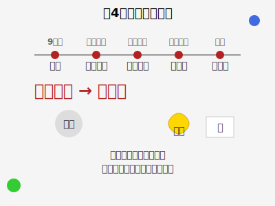

# 第4章：典故与历史

本章将探讨片假字在日本历史和文化中的使用，包括相关的历史故事、典故和文化背景。

## 片假字的历史发展

### 起源与早期使用
片假名起源于中国汉字的草书体，大约在9世纪左右形成。最初是作为佛教经典的训读符号使用，后来逐渐发展成为完整的表音文字系统。

在日本平安时代（794-1185年），片假名主要用于官方文件和佛教文献。由于其形状简洁，书写方便，逐渐被广泛使用。

### 中世时期的演变
在镰仓时代（1185-1333年）和室町时代（1336-1573年），随着武士阶层的兴起和禅宗佛教的传播，片假名的使用更加普及。

这一时期，片假名不仅用于正式文件，也开始出现在文学作品中，如《平家物语》等。

### 近世的发展
江户时代（1603-1868年）是片假名发展的重要时期。随着商业的繁荣和市民文化的兴起，片假名被广泛用于商业文件、通俗文学和戏剧脚本。

浮世草子等通俗文学作品大量使用片假名，使得这种文字形式更加深入人心。

### 现代的使用
明治维新后，日本开始大量吸收西方文化，片假名成为书写外来语的主要方式。这一传统一直延续至今，使得片假名在现代日语中占据了重要地位。

## 与片假字相关的历史故事

### 空海与片假字
传说日本高僧空海（774-835年）在创造平假名的同时，也参与了片假名的整理工作。虽然这一说法缺乏确凿的历史证据，但反映了片假名在日本文化中的重要地位。

### 佛教文献中的片假字
在奈良时代和平安时代，大量佛教经典从中国传入日本。为了便于日本僧侣理解和诵读，这些经典被用片假名进行注音，形成了独特的"训读"系统。

### 商业文件中的片假字
江户时代，随着商业的发展，商人需要快速书写商业文件。片假名因其书写简便，成为商业文件的主要文字形式，这也促进了片假名的普及。

## 文化背景

### 片假字与日本美学
片假名的简洁形状体现了日本文化中的"间"（ま）美学概念，即通过留白和简约来表达深层含义。

### 片假字与现代日本社会
在现代日本社会中，片假名不仅是书写外来语的工具，也成为了表达现代性和国际化的重要符号。

## 著名文献中的片假字使用

### 《万叶集》
虽然《万叶集》主要使用汉字和万叶假名，但在一些诗歌中也能看到片假名的早期使用痕迹。

### 《源氏物语》
紫式部的《源氏物语》中，片假名被用于书写女性角色的对话，体现了当时社会对不同性别使用不同文字的社会规范。

### 现代文学作品
夏目漱石、芥川龙之介等现代作家在其作品中大量使用片假名书写外来语，反映了明治维新后日本社会的西化趋势。

## 片假字与日本教育

### 教育制度中的片假字
在日本的教育制度中，学生需要掌握包括片假名在内的假名系统。小学一年级学生就需要学会平假名和片假名的基本读写。

### 片假字学习的重要性
片假名的学习不仅是为了掌握文字本身，更是为了理解日本文化和历史发展的重要途径。

## 片假字在不同历史时期的特色

### 平安时代的优雅
平安时代的片假名书写风格优雅，多用于宫廷文学和贵族之间的通信。

### 江户时代的实用
江户时代的片假名书写更加实用化，多用于商业文件和通俗文学。

### 现代的国际化
现代的片假名承担着表达国际化和现代化的重要功能，成为日本与世界交流的重要工具。