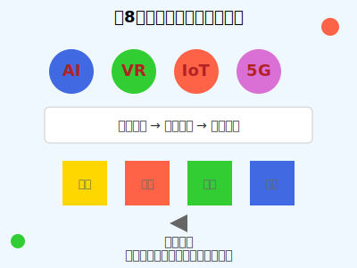

# 第8章：片假字的未来发展与学习建议

本章将探讨片假字在未来的发展趋势，并为学习者提供学习建议和方法。

## 片假字的现代应用

### 科技领域
随着科技的发展，越来越多的科技词汇使用片假字书写：
- コンピューター (konpyūtā, computer)
- インターネット (intānetto, internet)
- スマートフォン (sumātofon, smartphone)
- アプリケーション (apurikēshon, application)

### 商业领域
在商业领域，片假字被广泛用于品牌名称和产品名称：
- トヨタ (Toyota)
- ソニー (Sony)
- パナソニック (Panasonic)
- ニコン (Nikon)

### 文化娱乐领域
在文化娱乐领域，片假字被用于电影、音乐、游戏等的标题：
- アバター (Avatar)
- タイタニック (Titanic)
- ポケモン (Pokemon)
- マリオ (Mario)

## 片假字在国际交流中的作用

### 语言桥梁
片假字作为外来语的主要书写方式，在国际交流中发挥着重要作用，帮助日本人理解和使用外语词汇。

### 文化传播
通过片假字，外国文化概念得以在日本传播，促进了文化交流与理解。

### 教育工具
片假字在日语教育中是重要的工具，帮助学习者掌握外来语词汇。

## 片假字学习的重要性

### 语言能力提升
掌握片假字有助于提升日语综合能力，特别是阅读和听力理解能力。

### 文化理解
通过学习片假字，可以更好地理解日本文化和社会发展。

### 职业发展
在国际化的工作环境中，掌握片假字有助于职业发展。

## 学习片假字的方法和建议

### 基础学习
1. **掌握基本片假字**：首先熟练掌握基本的片假字字符和发音。
2. **练习书写**：通过反复练习，熟悉片假字的书写方式。
3. **记忆词汇**：积累常用的片假字词汇，建立词汇库。

### 进阶学习
1. **语境学习**：在实际语境中学习片假字的使用，理解其含义和用法。
2. **对比学习**：对比中文和日语中相同外来语的不同表达方式。
3. **扩展阅读**：通过阅读日语材料，接触更多的片假字词汇。

### 实践应用
1. **日常应用**：在日常生活中注意观察和使用片假字。
2. **交流实践**：通过与日本人交流，提高片假字的实际应用能力。
3. **创作表达**：尝试用片假字进行创作，如写诗、写故事等。

## 片假字学习的难点与解决方法

### 发音难点
1. **长音掌握**：注意长音"ー"的正确使用和发音。
2. **促音掌握**：掌握促音"ッ"的使用规则和发音特点。
3. **音调掌握**：注意日语的音调变化，避免中式发音。

### 词汇难点
1. **词汇量积累**：通过分类记忆法，系统积累片假字词汇。
2. **词汇用法**：通过例句学习，掌握词汇的正确用法。
3. **词汇辨析**：注意相似词汇的区别，避免混淆。

### 文化难点
1. **文化背景**：了解词汇背后的文化背景，加深理解。
2. **语境理解**：在具体语境中理解词汇的含义和用法。
3. **跨文化交际**：培养跨文化交际能力，提高实际应用水平。

## 片假字学习资源推荐

### 书籍资源
1. 《片假字学习手册》- 系统介绍片假字的学习方法和技巧。
2. 《日语外来语词典》- 收录大量片假字词汇及其用法。
3. 《日本文化与片假字》- 探讨片假字与日本文化的关系。

### 网络资源
1. 片假字学习网站 - 提供在线学习和练习平台。
2. 日语学习APP - 通过手机应用随时随地学习片假字。
3. 在线词典 - 提供片假字词汇的查询和发音功能。

### 多媒体资源
1. 日语学习视频 - 通过视频学习片假字的发音和用法。
2. 日语歌曲 - 通过歌曲学习片假字词汇和文化背景。
3. 日语电影 - 通过电影提高片假字的实际应用能力。

## 片假字学习的时间规划

### 初级阶段（1-3个月）
1. 掌握基本片假字字符和发音
2. 学习常用片假字词汇
3. 练习基本书写和发音

### 中级阶段（3-6个月）
1. 扩展片假字词汇量
2. 学习片假字在不同语境中的使用
3. 提高阅读和听力理解能力

### 高级阶段（6个月以上）
1. 掌握专业领域的片假字词汇
2. 提高片假字的实际应用能力
3. 培养跨文化交际能力

## 片假字学习的评估方法

### 自我评估
1. **定期测试**：通过定期测试评估学习进度。
2. **学习日志**：记录学习过程和心得体会。
3. **实际应用**：通过实际应用检验学习效果。

### 外部评估
1. **考试评估**：通过相关考试评估语言水平。
2. **交流评估**：通过与他人交流评估实际应用能力。
3. **作品评估**：通过创作作品评估综合运用能力。

## 片假字学习的注意事项

### 学习态度
1. **保持兴趣**：保持对片假字学习的兴趣和热情。
2. **坚持不懈**：坚持长期学习，不断积累和提高。
3. **积极实践**：积极寻找实践机会，提高实际应用能力。

### 学习方法
1. **因材施教**：根据个人特点选择合适的学习方法。
2. **循序渐进**：按照学习规律，循序渐进地提高。
3. **学以致用**：注重理论与实践相结合。

### 学习环境
1. **创造环境**：创造良好的学习环境和氛围。
2. **利用资源**：充分利用各种学习资源和工具。
3. **交流合作**：与他人交流合作，共同提高。

## 片假字的未来发展趋势

### 数字化发展
随着数字化技术的发展，片假字的学习和应用将更加便捷和高效。

### 国际化发展
随着国际交流的增加，片假字在国际上的影响力将进一步扩大。

### 创新发展
随着社会的发展，片假字将不断有新的应用和创新。

## 结语

片假字作为日语的重要组成部分，承载着丰富的文化内涵和历史价值。通过学习片假字，我们不仅可以提高日语水平，还可以更好地理解日本文化和社会发展。希望本词典能够为学习者提供有益的帮助，让大家在学习片假字的过程中感受到语言的魅力和文化的博大精深。